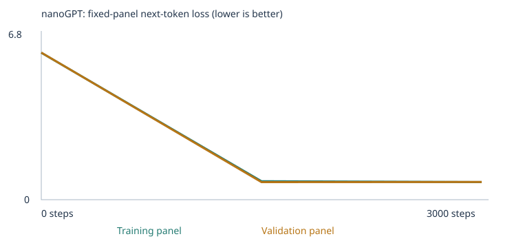
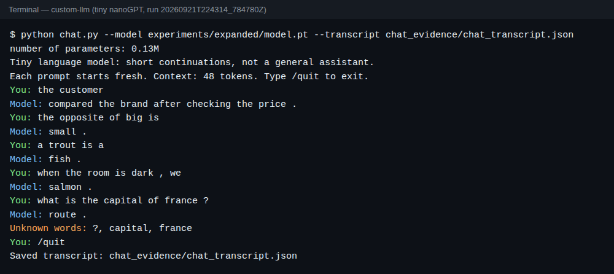

# My Custom LLM: a tiny nanoGPT trained from scratch

**Matt Wong · UC Berkeley Haas · Class 4, Assignment 3**

I trained Karpathy's nanoGPT (2 blocks, 4 heads, 64-number embeddings, 48-token context, word tokens) from random weights on a CPU. I ran two experiments:

- **Experiment A (starter):** the supplied classroom corpus only.
- **Experiment B (expanded):** the same corpus plus teaching files I wrote for three extension skills: **opposites**, **everyday knowledge**, and **categories/analogies**.

## Key takeaways

1. **The model learns patterns it has seen, not facts it hasn't.** Both models got all 16 starter patterns (16/16) right after training. Neither one can answer a real question (see chat below).
2. **Adding data helped because it added words.** With the same settings, the expanded model went from **20/48 → 29/48**. Coverage rose from 24 to 32 scorable cases, and 5 of the 8 newly scorable extension cases were answered correctly.
3. **The model learned the sentence frames but not the specific facts I held back.** Two examples:
   - I taught "the opposite of big is small" with *other* word pairs. The model then answered "the opposite of hot is" with **heavy**, not cold.
   - I taught "a calf grows into a cow" but not the kitten case. The model answered "a kitten grows into a" with **duck**.

   Each time it copied the shape of the sentence, not the relationship.
4. **Some changes can't be credited to my data.** The starter "new wording" cases rose from 4/8 to 8/8 in Experiment B, but I added *no* business sentences. A new vocabulary means different random starting weights and batch order, so this change may be run-to-run noise, not new skill.

---

## 1. Four-row eval comparison (all 48 fixed cases)

| Experiment | Stage | Correct / 48 | Scorable / 48 | Accuracy among scorable | Full results |
|---|---|---|---|---|---|
| Starter corpus | Untrained | 9 | 24 | 37.5% | [CSV](experiments/starter/language_evals/untrained/eval_results.csv) · [JSON](experiments/starter/language_evals/untrained/eval_results.json) · [summary](experiments/starter/language_evals/untrained/eval_summary.json) |
| Starter corpus | Trained | **20** | 24 | 83.3% | [CSV](experiments/starter/language_evals/final/eval_results.csv) · [JSON](experiments/starter/language_evals/final/eval_results.json) · [summary](experiments/starter/language_evals/final/eval_summary.json) |
| Expanded corpus | Untrained | 6 | 32 | 18.8% | [CSV](experiments/expanded/language_evals/untrained/eval_results.csv) · [JSON](experiments/expanded/language_evals/untrained/eval_results.json) · [summary](experiments/expanded/language_evals/untrained/eval_summary.json) |
| Expanded corpus | Trained | **29** | 32 | 90.6% | [CSV](experiments/expanded/language_evals/final/eval_results.csv) · [JSON](experiments/expanded/language_evals/final/eval_results.json) · [summary](experiments/expanded/language_evals/final/eval_summary.json) |

All-case success is correct / 48, and unscorable cases count as 0. Random guessing on four choices averages 25% of *scorable* cases. The untrained rows sit near that level, which is the expected baseline.

### By group (correct / scorable / total)

| Group | Starter untrained | Starter trained | Expanded untrained | Expanded trained |
|---|---|---|---|---|
| starter_patterns | 6 / 16 / 16 | **16 / 16 / 16** | 2 / 16 / 16 | **16 / 16 / 16** |
| starter_transfer (new wording) | 3 / 8 / 8 | 4 / 8 / 8 | 3 / 8 / 8 | **8 / 8 / 8** |
| extend_corpus | 0 / 0 / 24 | 0 / 0 / 24 | 1 / 8 / 24 | **5 / 8 / 24** |

### By extension category (correct / scorable, out of 3 each)

| Category | Chose to teach? | Starter trained | Expanded trained | What happened |
|---|---|---|---|---|
| Opposites | ✅ | 0 / 0 | **1 / 2** | ✅ empty→**full**. ❌ hot→**heavy** (wanted cold). "noisy" case unscorable because the distractor word *round* was never in my data. |
| Everyday knowledge | ✅ | 0 / 0 | **3 / 3** | ✅ water freezes into **ice**, umbrella to stay **dry**, turn on a **light** |
| Categories & analogies | ✅ | 0 / 0 | **1 / 3** | ✅ salmon→**fish**. ❌ kitten→**duck** (wanted cat). ❌ apple→**fabric** (wanted fruit) |
| Grammar, negation, reference, sequence, spatial | ❌ | 0 / 0 | 0 / 0 | Not taught. These stayed unscorable because of unknown words (e.g. *walked*, *ava*, *finn*, *below*). |

### Free continuations vs. multiple-choice (expanded, trained)

The multiple-choice score only compares the probability of the four answer words. The free text is what the model *actually writes* (temperature 0.8, 24-token limit), and it can disagree with its own multiple-choice pick:

| Prompt | Multiple-choice pick | Free continuation |
|---|---|---|
| a person uses an umbrella to stay | **dry** ✅ (p = 0.62) | "dry ." |
| water freezes into | **ice** ✅ (p = 0.07) | "are opposites ." ← wrong frame |
| to see in a dark room we turn on a | **light** ✅ | "juice ." |
| the opposite of hot is | heavy ❌ | "quiet ." |
| a robin is a bird . a salmon is a | **fish** ✅ | "hot ." |
| a carrot is a vegetable . an apple is a | fabric ❌ | "hospital ." |

**Takeaway:** a correct multiple-choice pick often comes with low confidence (ice at only 7%) and nonsense free text. The model is ranking four words, not "knowing" the answer.

In the starter run, the new-wording failures show the same split. For "yesterday the school discussed the educator and the", the model picked **harvest** (wanted *student*) but freely wrote "local lecturer .", which is the right topic with the wrong word.

### What changed, and why (vocabulary vs. learned patterns)

- **Vocabulary coverage** explains the jump from 24 to 32 scorable cases. Training the starter model longer could never have produced this: the starter vocabulary has only 136 words and no *hot*, *ice*, *fish*, or *opposite*.
- **Learned patterns** explain which of those 8 new cases were correct:
  - The model did best where a test used the *same kind of frame* I taught with other examples. The umbrella/dry and dark/light scenes appear in my data in different wording.
  - It failed where the answer depended on a *specific pair I withheld* from that frame. It fell back to a pair it had seen, e.g. "heavy" (from *the opposite of heavy is light*) or "duck" (from *a duckling grows into a duck*).
- **Things I can't attribute to my data:** the starter-transfer gain (4→8) and the 3 non-chosen categories that stayed at 0. Grammar, negation, reference, sequence, and spatial got nothing new, so no change was expected there.

---

## 2. Corpus, sources, and leakage checks

| Source | Mode | Unique passages | Notes |
|---|---|---|---|
| Classroom teaching sentences (generated by the notebook) | `CORPUS = "classroom"` | 4,592 (after 160 test-prefix sentences were withheld) | Business, food, transport, tech, health, education |
| [`corpus/opposites.txt`](corpus/opposites.txt) | added in B | 352 | My own writing |
| [`corpus/everyday_knowledge.txt`](corpus/everyday_knowledge.txt) | added in B | 108 | My own writing |
| [`corpus/categories_and_analogies.txt`](corpus/categories_and_analogies.txt) | added in B | 66 | My own writing. Most two-sentence lines were split into one-sentence passages (see limitation) |

All three extension files are my own writing, generated reproducibly by [`make_extension_corpus.py`](make_extension_corpus.py). I have full permission to share them. There are no PDFs, so no PDF extraction warnings (see [`corpus_manifest.json`](experiments/expanded/corpus_manifest.json): `warnings: []` for every file).

**Why these three categories:**

- They are the skills a tiny model can plausibly learn from a **word + frame** pattern ("the opposite of X is Y", "a X is a Y"). They don't need to track who did what across sentences, which is what reference, negation, and sequence require.
- The starter run showed they failed **only because of missing words** (0% coverage), so new teaching data was the right fix.

**How the teaching material addresses the gap, without copying the exam:**

- **Frame, different fillers:** 22 opposite pairs (big/small, early/late …), about 45 category members (a trout is a fish …), and 10 young→adult animal pairs (a calf grows into a cow …).
- **Test-relevant words, different frames only:**
  - *hot / cold*, *empty / full*, and *noisy / quiet* appear only in contrast scenes, e.g. "the street is noisy but the library is quiet".
  - *robin, salmon, carrot, apple, puppy, kitten* appear only in other sentence shapes, e.g. "a young cat is called a kitten".
  - Water/ice, umbrella/dry, and dark/light are taught with different wording and people.
- **Other choices:** names differ from every name in the eval suite. Wrong-answer words (sand, pillow, spoon, shoe …) also get their own normal sentences, so the model knows them too.

**Leakage checks (eval material kept out of training and vocabulary):**

1. The notebook withholds classroom sentences containing any test prefix before the split: **160 withheld** ([`eval_separation.json`](experiments/expanded/eval_separation.json)). It also rejects exact test prompts in `corpus/` and refuses a corpus folder that contains `evals/`.
2. I added a stricter audit, [`check_corpus_leakage.py`](check_corpus_leakage.py). It flags any corpus line containing a full test prompt, **any single sentence from a prompt** (e.g. "a robin is a bird ."), or **the final clause + its answer** (e.g. "stay dry"-style completions of the exact prompt). Result: **0 matches**. I also verified it catches a planted leak.
3. My generator script never opens `evals/`. Chat transcripts and eval outputs live in `experiments/` and `chat_evidence/`, outside `corpus/`.
4. **Limits:** these are exact-text checks, not meaning checks. Some sentences state the same underlying *knowledge* in different words, like "hot and cold are opposites". The assignment allows this ("ordinary words and underlying subject knowledge may overlap"). Because I read the tests while designing the data, this is a **development benchmark**, not an unseen test of generalization.

---

## 3. My choices, prediction, and run details

| Setting | Value | Why |
|---|---|---|
| Corpus | classroom (A), classroom + `corpus/` (B) | A is the baseline. B changes **only the data** |
| Training steps | 3,000 | The suggested budget. Loss had already flattened by step 1,500 (see table), so more steps would mostly memorize |
| Learning rate | 0.001 (with warmup and cosine decay) | Standard for AdamW at this size. **Too large** makes updates overshoot, so loss bounces or explodes. **Too small** means weights barely move in 3,000 steps, and the model stays near random |

My written predictions are in the first markdown cell of each notebook, written before training.

- **What I got right:** loss falls steeply; validation stays close to training; starter patterns get learned; 0/24 extension cases in A; extension categories become scorable in B.
- **What I got wrong:** I expected the starting loss near ln(512) ≈ 6.2. The starter vocabulary is only 136 words, so it started at **4.93 ≈ ln(136)**. That's what "uniform guessing over the vocabulary" predicts. B started at 6.14 ≈ ln(459).
- **What I didn't predict:** starter transfer rising to 8/8 in B, and the model preferring *heavy* for "the opposite of hot is".

| | Experiment A (starter) | Experiment B (expanded) |
|---|---|---|
| Completed steps | 3,000 (not interrupted) | 3,000 (not interrupted) |
| Elapsed training time | 23.6 s | 25.7 s |
| Hardware | CPU only, Linux x86-64, PyTorch 2.14 (cloud workspace) | same |
| Parameters | 111,872 | 132,544 (bigger vocabulary → bigger embedding table) |
| Vocabulary | 136 tokens (133 word types + `<UNK>`,`<BOS>`,`<EOS>`) | 459 tokens (456 word types + 3 special tokens) |
| Train / validation passages | 4,132 / 460 | 4,606 / 512 (90/10 split) |
| Training / held-out unknown rate | 0.0% / 0.0% | 0.0% / 0.21% |
| Links | [notebook](custom_llm_starter.ipynb) · [config](experiments/starter/config.json) · [summary](experiments/starter/training_summary.json) · [training.csv](experiments/starter/training.csv) · [vocab report](experiments/starter/vocabulary_report.json) · [manifest](experiments/starter/corpus_manifest.json) · [results ZIP](experiments/starter_results.zip) | [notebook](custom_llm_expanded.ipynb) · [config](experiments/expanded/config.json) · [summary](experiments/expanded/training_summary.json) · [training.csv](experiments/expanded/training.csv) · [vocab report](experiments/expanded/vocabulary_report.json) · [manifest](experiments/expanded/corpus_manifest.json) · [results ZIP](experiments/expanded_results.zip) |

- **Vocabulary cap:** neither run hit the 509-type cap, so no training words became `<UNK>` (`omitted_types: []`).
- **What the split tests:** it is by *passage*, not by source file. Validation sentences come from the same templates as training sentences, so validation loss tests "new sentences from familiar templates", not new topics.

**Held fixed across both experiments:** seed 42, model size, batch size 32, steps, learning-rate schedule, eval panel size, all 48 eval cases, and the eval settings (seed 2026, temperature 0.8, 24 tokens). **Changed in training:** only the corpus, and therefore the vocabulary. **Changed only at inference:** temperature (section 5), which never touches weights.

---

## 4. Loss and samples

| Experiment A (starter) | Experiment B (expanded) |
|---|---|
|  |  |

These are **fixed panels of 20 training and 20 validation passages**, averaging every non-padding next-token prediction. They are small estimates, not full-corpus loss. Full data: [A history.json](experiments/starter/history.json), [B history.json](experiments/expanded/history.json).

| Experiment | Step | Training-panel loss | Validation-panel loss |
|---|---|---|---|
| A starter | 0 | 4.9263 | 4.9275 |
| A starter | 1,500 | 0.6821 | 0.7182 |
| A starter | 3,000 | 0.6783 | 0.7061 |
| B expanded | 0 | 6.1398 | 6.1466 |
| B expanded | 1,500 | 0.7714 | 0.7330 |
| B expanded | 3,000 | 0.7370 | 0.7396 |

**Takeaway:** almost all the learning happens in the first half. Validation tracks training closely, so there is no sign of overfitting, but that's partly because validation reuses the same templates. A and B losses are **not comparable**: different corpora and vocabularies.

**Samples** (same sampling seed and settings at each stage). Full files: A [step 0](experiments/starter/samples/step_0000.txt) · [1500](experiments/starter/samples/step_1500.txt) · [3000](experiments/starter/samples/step_3000.txt); B [step 0](experiments/expanded/samples/step_0000.txt) · [1500](experiments/expanded/samples/step_1500.txt) · [3000](experiments/expanded/samples/step_3000.txt)

| Stage | Experiment A sample | Experiment B sample |
|---|---|---|
| Untrained (0) | "pear professor bond doctor course harvest team physician journey checking buyer …" | "lots opposite run <BOS> it heavy salmon clothes an window office gives …" |
| Halfway (1,500) | "our school has a question about the new educator and lesson ." | "today the office focused on update and the different platform ." |
| Final (3,000) | "the report about the nurse explains the health in detail ." | "we learned about the important instructor during a discussion of lesson ." |

- **Visible change:** random word salad at step 0 (any word is about equally likely) becomes grammatical classroom-template sentences by step 1,500.
- **Lack of change:** from 1,500 to 3,000, the first two A samples are *identical*, matching the flat loss.
- **Not shown in samples:** none of the B samples use my extension sentences. They are only about 10% of passages, and the samples start from `<BOS>`, where classroom templates dominate.

---

## 5. How it learns: one word traced end to end

Source: Experiment B, [tokenization.json](experiments/expanded/tokenization.json) and [inspection.json](experiments/expanded/inspection.json). Experiment A equivalents: [tokenization](experiments/starter/tokenization.json) · [inspection](experiments/starter/inspection.json).

**Corpus → tokens → IDs.** The corpus is just text. The tokenizer splits it into lowercase words and punctuation (**tokens**). Each distinct token gets a row number (**ID**).
- "customer" → **ID 84** in B (ID 28 in A: IDs are arbitrary row numbers, and they changed when the vocabulary changed).
- The sentence "the subscriber recommended the offering after checking the price ." becomes `[1 (<BOS>), 393, 372, 313, 393, …]`.
- Training pairs each position with the *next* ID as its target.

**ID → vector (embedding).** Row 84 of the 459 × 64 embedding table is customer's **embedding**: 64 learned numbers. It starts random and small, and training moves it.

| | first 8 of 64 numbers |
|---|---|
| before training | −0.0068, 0.0239, 0.0081, 0.0338, −0.0104, 0.0214, −0.0257, 0.0004 … |
| after training | −0.0610, 0.1550, 0.1052, 0.0844, 0.0965, 0.1296, 0.1445, −0.0130 … |

<details><summary>All 64 numbers, before and after</summary>

Before: `[-0.0068, 0.0239, 0.0081, 0.0338, -0.0104, 0.0214, -0.0257, 0.0004, -0.0349, 0.0139, -0.0350, -0.0274, -0.0034, 0.0257, -0.0273, -0.0183, -0.0014, -0.0067, 0.0091, -0.0074, 0.0043, 0.0343, 0.0188, -0.0127, 0.0339, 0.0136, 0.0187, -0.0231, 0.0108, 0.0130, 0.0090, 0.0413, 0.0001, -0.0174, 0.0055, 0.0058, -0.0002, 0.0063, -0.0152, -0.0526, -0.0112, 0.0147, -0.0263, 0.0173, -0.0179, 0.0141, -0.0177, -0.0017, 0.0111, 0.0163, -0.0024, -0.0160, -0.0384, -0.0116, -0.0227, 0.0379, 0.0273, -0.0276, 0.0030, -0.0328, 0.0022, 0.0018, 0.0225, 0.0198]`

After: `[-0.0610, 0.1550, 0.1052, 0.0844, 0.0965, 0.1296, 0.1445, -0.0130, 0.0964, 0.0186, 0.0070, 0.0643, 0.0149, -0.0253, -0.1524, 0.0780, -0.0969, -0.0982, -0.0183, 0.0581, -0.0468, -0.1075, -0.0271, 0.0823, 0.0921, -0.0614, 0.0581, -0.0759, 0.0857, -0.0015, -0.1389, -0.0492, 0.0278, -0.1105, -0.0066, -0.1198, 0.0809, 0.0098, -0.0252, -0.1151, -0.0359, 0.0958, 0.0937, 0.0055, -0.1576, 0.1092, 0.0668, 0.0402, -0.0728, 0.0614, 0.0922, 0.0684, -0.1264, 0.0786, -0.0195, 0.0143, 0.0662, -0.0368, -0.0942, -0.0771, -0.1022, -0.0794, -0.0638, -0.0418]`
</details>

**Neural network → loss → gradient → update.**
- **Why it's a neural network:** the embedding goes through layers of weights (attention + feed-forward) with nonlinear activations (GELU). The network outputs a score for every word in the vocabulary.
- **Loss:** measures how little probability the model gave the real next word.
- **Gradients:** backpropagation computes, for each of the 132,544 weights, which direction would lower that loss.
- **The first real update to customer's coordinate 0:**

| before | gradient | learning rate (warmup step 1) | after |
|---|---|---|---|
| −0.0068142 | −0.00037316 | 0.00001 | −0.0068042 |

- The gradient is **negative**, so increasing this number lowers the loss, and the value went **up**.
- The step size (+0.00001) is exactly the learning rate, not learning rate × gradient. On the first step, AdamW divides the gradient by its own running size, so the first move is roughly ±lr no matter how small the gradient is. (Weight decay adds a tiny extra shrink.)
- Thousands of steps like this moved customer's vector from about ±0.03 to about ±0.15.

**Probabilities before vs. after** for the prefix "the customer":

| | top next words |
|---|---|
| untrained | customer 0.39%, team 0.35%, lecturer 0.33%, filled 0.32%, mentioned 0.31% (nearly uniform ≈ 1/459) |
| trained | **selected 20.1%, reviewed 17.7%, ordered 17.0%, recommended 16.5%, compared 14.2%** |

**Takeaway:** training moved about 86% of the probability onto the five verbs that follow "the customer" in the corpus.

**Attention.** At each position, attention builds a weighted mix of the vectors of *earlier* tokens. Block 1, head 1 for `<BOS> the customer` (B):

- "the" splits 0.48 / 0.52 between `<BOS>` and itself.
- "customer" puts 0.08 on `<BOS>`, 0.33 on "the", and 0.59 on itself.

The upper-right entries are exactly 0 because of the **causal mask**. The model is trained to predict the next word, so letting it see future words would be cheating, and the prediction would be meaningless at generation time.

**Probabilities → text, and temperature** ([A](experiments/starter/temperature_comparison.json) · [B](experiments/expanded/temperature_comparison.json)). To generate text:
1. The model turns its scores into probabilities (softmax).
2. It **samples** one word, appends it, and repeats until `<EOS>`.

**Temperature** divides the scores before softmax. Low (0.3) sharpens toward the top word; high (1.2) flattens toward more random picks. **No weights change.** Same seed, Experiment B:

| Temp | sample 2 | sample 3 |
|---|---|---|
| 0.3 | "the new deposit was mentioned in the interest report yesterday ." | "today the hospital focused on treatment and the important doctor ." |
| 0.8 | "we learned about the new professor during a discussion of course ." | "we learned about the important instructor during a discussion of lesson ." |
| 1.2 | "we learned about the new therapist during a discussion of health ." | "we learned about the important instructor during a discussion of lesson ." |

Sample 1 is identical at all three temperatures ("today the office focused on update and the different platform ."). The model is so confident on these templates that even 1.2 rarely changes the pick. The differences show up in the swap-in nouns (professor vs. therapist).

---

## 6. Chat interface

A terminal chat, [`chat.py`](chat.py), loads my **trained Experiment B model**: [`experiments/expanded/model.pt`](experiments/expanded/model.pt), run `20260921T224314_784780Z`, 3,000 steps. The weights and saved vocabulary live together in `model.pt`.

- **What it is:** a tiny language model that *continues text*. It is not a Q&A assistant.
- **No memory:** each prompt starts fresh, with no conversation history.
- **Context limit:** at most 48 tokens of context.
- **Unknown words:** words outside the 459-token vocabulary are shown and become `<UNK>`.
- **No learning while chatting:** replies never retrain the model or touch the corpus.

```sh
pip install -r requirements.txt
python chat.py --model experiments/expanded/model.pt --transcript chat_evidence/my_chat.json
# type a prompt, press Enter; /quit to exit
```



The image is a rendering of the real recorded terminal session ([terminal_session.txt](chat_evidence/terminal_session.txt)). The saved transcript with seeds, model hash, and unknown words is [chat_transcript.json](chat_evidence/chat_transcript.json).

| # | Prompt | Model reply | Comment |
|---|---|---|---|
| 1 | the customer | compared the brand after checking the price . | Fluent, because it's a memorized classroom template |
| 2 | the opposite of big is | small . | ✅ My opposites frame, taught directly |
| 3 | a trout is a | fish . | ✅ My categories frame |
| 4 | when the room is dark , we | salmon . | ❌ **Failure.** Every word is known, but the frame differs from my teaching sentences, so it grabs an unrelated word |
| 5 | what is the capital of france ? | route . | ❌ **Limitation.** "capital", "france", and "?" are unknown words (shown by the interface). The model can't answer questions |

**Takeaway:** the model does well only on phrasings close to its training data.

---

## 7. Rerun the evals on the saved model

```sh
pip install -r requirements.txt
python run_evals.py --model experiments/expanded/model.pt --output results/expanded-final
python run_evals.py --model experiments/expanded/model_untrained.pt --stage untrained --output results/expanded-untrained
python run_evals.py --model experiments/starter/model.pt  --output results/starter-final
python run_evals.py --model experiments/starter/model_untrained.pt --stage untrained --output results/starter-untrained
```

I reran the expanded-final command and got the identical 29/48 summary.

**Scoring rules:**
- The runner feeds **only the prompt** to the model.
- It compares the probabilities of the 4 choices. Highest correct = 1; wrong or tie = 0.
- Any unknown word in the prompt or choices makes the case *unscorable*, and it counts as 0 in the all-case rate.
- The free text is saved separately and never scored.
- The suite ([`evals/language_evals.json`](evals/language_evals.json)) is unchanged; its SHA-256 is recorded in every summary.

**Reproduce everything from scratch:** `python make_extension_corpus.py` (writes `corpus/`) → `python check_corpus_leakage.py` → open [`custom_llm_expanded.ipynb`](custom_llm_expanded.ipynb) and Run All.
- For the starter run, empty `corpus/` (keep its README) and run [`custom_llm_starter.ipynb`](custom_llm_starter.ipynb).
- `custom_llm.ipynb` is the untouched course starter.
- Colab works too: upload the three `corpus/*.txt` files into `/content/corpus`.

---

## 8. Limitation and next experiment

**Observed limitation: the passage splitter breaks my two-sentence examples apart.**
- The notebook cuts text at every ". ", so each teaching line like "a trout is a fish . a banana is a fruit ." became two one-sentence passages.
- In the manifest, `categories_and_analogies.txt` shows 514 passages but only 66 unique.
- So the model **never trained on the two-sentence analogy shape** that the category tests use ("a robin is a bird . a salmon is a …"), and it got 1 of 3.
- Its single-sentence tests did better: everyday knowledge got 3 of 3.

**Next experiment:** keep everything else fixed and change **one** thing: split passages on line breaks instead of on every period, so each multi-sentence line stays one training passage.
- **Prediction:** categories/analogies improves (especially kitten→cat, if I also add more "young → adult" pairs), and starter scores stay the same.
- **Second fix:** add the missing distractor *round* so the "noisy" opposites case becomes scorable.

Because I'd be tuning against these public tests, any gain should be confirmed on a fresh set of analogy tests I never looked at.

## Repository map

```
README.md                      ← this report
custom_llm_starter.ipynb       ← executed notebook, Experiment A
custom_llm_expanded.ipynb      ← executed notebook, Experiment B
custom_llm.ipynb               ← untouched course starter
make_extension_corpus.py       ← writes my corpus/ files (never reads evals/)
check_corpus_leakage.py        ← stricter leakage audit
corpus/                        ← my teaching files (B only)
evals/language_evals.json      ← fixed 48-case suite (unchanged)
run_evals.py, chat.py          ← eval runner and terminal chat (course-provided)
experiments/starter/, experiments/expanded/  ← full run folders + results ZIPs
chat_evidence/                 ← transcript, terminal log, screenshot
COURSE_README.md, ASSIGNMENT.md ← original course instructions
examples/                      ← course-provided reference run, NOT my results
legacy/                        ← earlier character-level microgpt lab, kept for reference
```

`examples/` and `legacy/` ship with the course sample repository. My submitted
evidence is only in `experiments/`, `corpus/`, `evals/`, and `chat_evidence/`.

Note on a coincidence: the course reference run in `examples/language-evals/` also
scores 9/48 untrained and 20/48 trained, the same headline numbers as my Experiment A.
It is a different model, not a copy of my results (or mine of its): the `model_sha256`
values in the summaries differ at both stages (mine `d16f052…`/`16791c5…`, the
reference `73fcac5…`/`bf49f05…`), because that hash is taken over the actual weight
tensors. Both runs use the same starter corpus, seed 42, and 3,000 steps, so the
trained score landing in the same place is unsurprising; the untrained match is
coincidence on a coarse 48-case metric. All six summaries record the identical
`suite_sha256` `1d7c503f…`, which is the canonical hash of the unchanged 48 cases.
